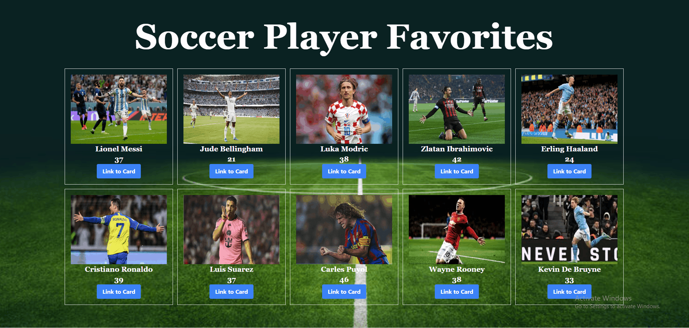

# Web Development Project 1 - *Name of App Here*

Submitted by: Abid Khan

This web app: I made a soccer player project that informs some of the people in my community about some of the popular soccer players in our time. It includes their Name, Age, and lastly a link to their eaFc 

Time spent: 3 hours spent in total

## Required Features

The following **required** functionality is completed:

- [X] **There is a unique theme for events or resources relevant to a specific community**
- [X] **At least 10 unique resources or events are displayed in a responsive card format**

The following **optional** features are implemented:

- [X] Buttons or links to a related resources are on each card component
- [X] The site is responsive for both desktop and mobile formats

The following **additional** features are implemented:

* [X] List anything else that you added to improve the site's functionality! 
**I made a table to list the then players so that the user would not have to scroll through the project.**

## Video Walkthrough

Here's a walkthrough of implemented required features:

<!-- Replace this with whatever GIF tool you used! -->
GIF created with screentogif  
<!-- Recommended tools:
[Kap](https://getkap.co/) for macOS
[ScreenToGif](https://www.screentogif.com/) for Windows
[peek](https://github.com/phw/peek) for Linux. -->

## Notes

Describe any challenges encountered while building the app.

## License

    Copyright [2024] [Abid Khan]

    Licensed under the Apache License, Version 2.0 (the "License");
    you may not use this file except in compliance with the License.
    You may obtain a copy of the License at

        http://www.apache.org/licenses/LICENSE-2.0

    Unless required by applicable law or agreed to in writing, software
    distributed under the License is distributed on an "AS IS" BASIS,
    WITHOUT WARRANTIES OR CONDITIONS OF ANY KIND, either express or implied.
    See the License for the specific language governing permissions and
    limitations under the License.